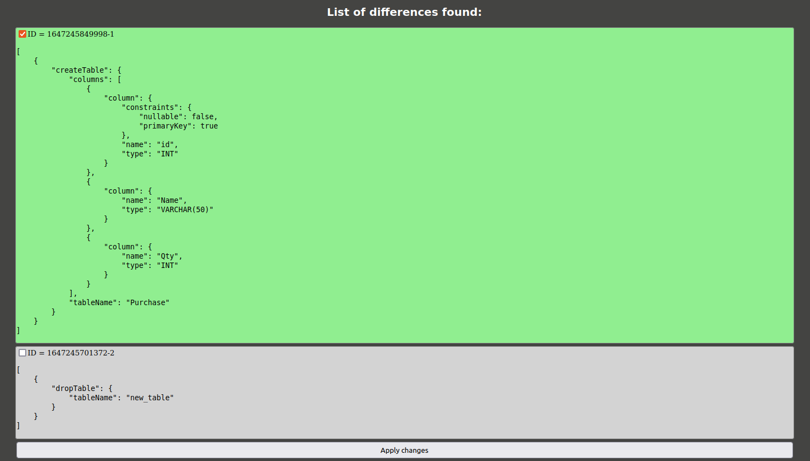

# Liquibase Diff Tool GUI
A simple web-based interface to use the diff-changelog command of [Liquibase](https://liquibase.org/) for assessing DB differences.

## Usage

1. Build the Docker image (it include Apache, PHP, Liquibase with MySQL connector)   
```docker build -t liquibase/liquibase-mysql-apache .```
2. Run the Docker container   
```docker run --rm -it --name lqgui -p 8080:80 liquibase/liquibase-mysql-apache```
3. Go to [http://localhost:8080/](http://localhost:8080/) and fill the form fields to connect to reference and target DBs


4. The system responds with the list of found changesets


You can select which changeset should be applierd to the target DB



and finally press the Apply Changes button

5. The changelog to be applied is shown 


6. After confirming the chagelog the changes are applied to the target DB and a success message is shown


